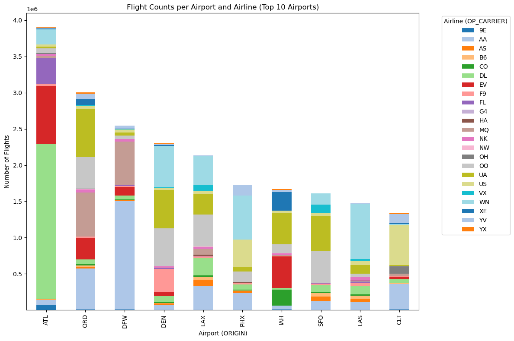
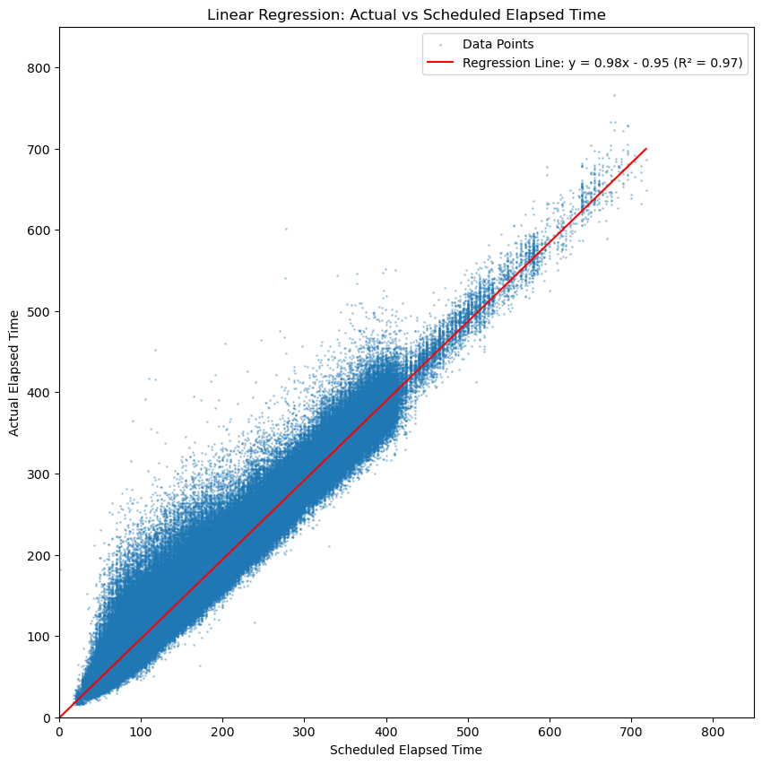
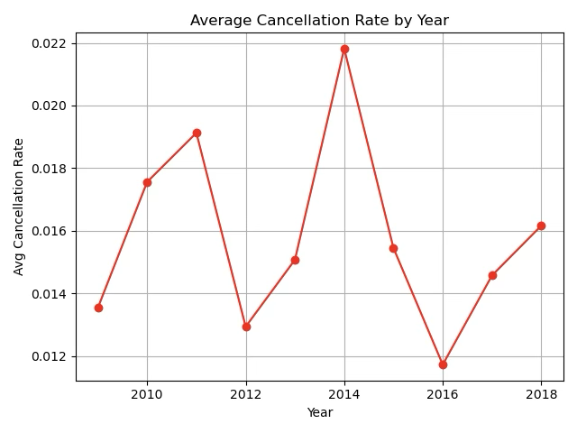
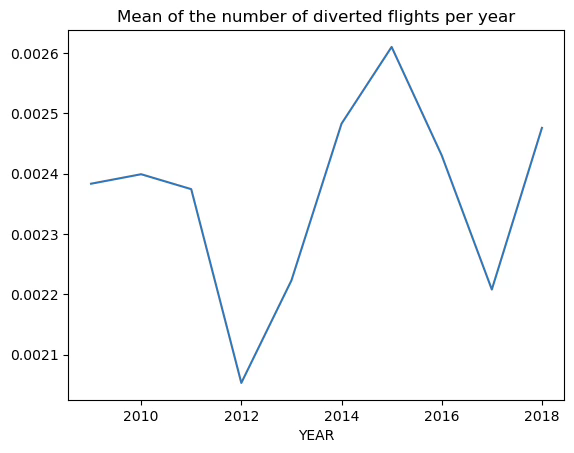
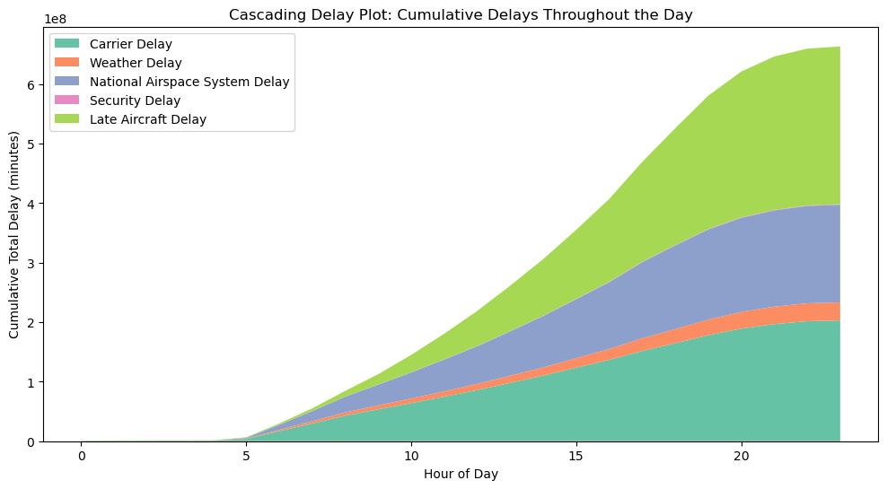

# Project of Data Visualization (COM-480)

| Student's name | SCIPER |
| -------------- | ------ |
| | |
| | |
| | |

[Milestone 1](#milestone-1) • [Milestone 2](#milestone-2) • [Milestone 3](#milestone-3)

## Milestone 1 (21st March, 5pm)

**10% of the final grade**

This is a preliminary milestone to let you set up goals for your final project and assess the feasibility of your ideas.
Please, fill the following sections about your project.

*(max. 2000 characters per section)*

### Dataset

> Find a dataset (or multiple) that you will explore. Assess the quality of the data it contains and how much preprocessing / data-cleaning it will require before tackling visualization. We recommend using a standard dataset as this course is not about scraping nor data processing.
>
> Hint: some good pointers for finding quality publicly available datasets ([Google dataset search](https://datasetsearch.research.google.com/), [Kaggle](https://www.kaggle.com/datasets), [OpenSwissData](https://opendata.swiss/en/), [SNAP](https://snap.stanford.edu/data/) and [FiveThirtyEight](https://data.fivethirtyeight.com/)), you could use also the DataSets proposed by the ENAC (see the Announcements section on Zulip).

Flight delays are a day-to-day issue affecting millions of people worldwide. These delays have significant economic, operational, and social impacts and affect the airlines, the airport operations, and the travelers themselves. In this project, we explore a comprehensive dataset called *"Airline Delay and Cancellation Data, 2009 - 2018"*, available on [Kaggle](https://www.kaggle.com/datasets/yuanyuwendymu/airline-delay-and-cancellation-data-2009-2018), containing detailed information on flight delays for domestic flights within the United States. This dataset consists of records of flights of major airlines such as Delta, American, and United Airlines as well as smaller airlines through international and regional airports in the US. The data makes use of the IATA code, a global standard for naming airports and airlines. This data is also well-equipped with scheduled and actual flight times, taxi time, wheels of time, overall delay durations, and its breakdown for different reasons such as weather conditions, airline operational issues, and air traffic control. This data is almost sound and complete across most critical columns. An important and probably the only stage that is required as preprocessing toward visualizing this data would be to complete it with the details of the airlines and the airport, such as name, the city they are located in, latitude and longitude (for visualization in a map format), the size of the airport, etc. This data can be extracted using WikiData API, as well as other online or offline data sources. The overall size of the data is over 7.5 GB. The size of the data necessitates pre-computing aggregation data to support real-time interactive visualizations without making the users wait for the plots to load. With that said, the size of the data and its overall cleanness are promising for extracting meaningful patterns without extensive preprocessing stages, which makes it an ideal dataset for our visualizations. In addition, as the data spans across 10 years, it allows us to uncover temporal trends in flight delays and help us gain insights on how the flight delay situation has changed over time.

### Problematic

> Frame the general topic of your visualization and the main axis that you want to develop.
> - What am I trying to show with my visualization?
> - Think of an overview for the project, your motivation, and the target audience.

Flight delays are a pervasive and frustrating experience for millions of travelers each year. These delays can come from a variety of factors, ranging from weather to operational inefficiencies, and impact not only passengers, but also airlines, airports, and broader logistical networks. Despite the scale of the issue, passengers often lack access to comprehensive and interpretable data that can help them make informed travel decisions. Moreover, stakeholders and professionals in the aviation sector struggle to identify delay trends at scale.

In this project, we aim to visualize patterns of domestic flight delays in the United States between 2009 and 2018. Our central axis include delay frequency and causes, and we aim to explore how does it vary across time, airlines, airports, and flight schedules. By this, we aim to answer questions such as: Which airports or airlines experience the most delays? How have delay times and causes changed over the years? Do flight times (e.g., morning versus evening) affect the likelihood of experiencing delays?

The primary audience for our project includes A) travelers who can use the visualizations to make better choices about flights, airlines, and airports, and B) researchers and policymakers who may use delay trends to find areas for operational improvement regarding transportation efficiency or advocate for passenger rights.

To serve this audience, we aim to develop an easy-to-use interactive visualization dashboard that allows users to compare airports and airlines, explore delay causes, and analyze temporal trends. Geo-spatial visualizations on a map, which we aim to include in our website, will further help users in locating the spots with higher likelihoods of delay across the US. Although the dataset is slightly outdated (with a cutoff date of 2018), the goal of our project is to demonstrate visualization approaches that are also scalable and adaptable to more recent rich datasets in case of availability in the future.

### Exploratory Data Analysis

> Pre-processing of the data set you chose
> - Show some basic statistics and get insights about the data

The dataset contains 61,556,964 records spanning ten years (mean of 6155696.4 per year, SD = 481266.1), ranging from ~ 5.6M records in 2016 to ~ 7.2M records in 2018. Each record includes information on the flight, the scheduled and actual departure and arrival times, and reasons for and information on delays.

We find a mean departure delay of 9.04 minutes with a median of 0.00, indicating that many flights depart on time. However, this data feature comes with a high standard deviation (37.14 minutes), suggesting variability in departure delay. Similarly, regarding the arrival delay, we find a mean of 4.70 and a median of -1.00 minutes (indicating arriving earlier than expected), but a standard deviation of 39.44 minutes. We also find that the 75th percentile for this feature is 18 minutes, suggesting that most flights have relatively small delays. An observation of the overall cancellation and diversion rate shows small relative values (1.58% and 0.24%, respectively).

We then explore the overall trends of the dataset across years. The mean departure delay, while peaking in 2014, has a generally increasing pattern from earlier years to later years (as can be seen in Figure 1), suggesting worsening delays. Regarding cancellation rates, we don't see a clear increasing or decreasing pattern over years (Figure 2). Similarly, regarding diversions, they remain relatively stable across the years (Figure 3), suggesting that flight re-routing due to operational constraints has not changed significantly.

*Figure 1: Average departure delay by year.*

*Figure 2: Average cancellation rate by year.*

*Figure 3: Mean of the number of diverted flights per year.*

We also find that flights scheduled earlier in the day, particularly around 5 AM, tend to experience minimal delays compared to the rest of the day, with many even departing slightly ahead of schedule. However, delays start accumulating throughout the afternoon, reaching their maximum in the late evening at around 8 PM (as can be seen in Figure 4). This pattern suggests that delays are compounding over the course of the day, likely due to higher air traffic congestion, operational inefficiencies, or rolling effects from earlier delays.

*Figure 4: Mean departure delay by scheduled hour.*

Additionally, we observe seasonal variations in flight delays (Figure 5). They tend to peak in June/July which aligns with the vacation season. The lowest average delays occur in September, possibly due to lower travel demand directly after the holidays and start of the school semester.

*Figure 5: Average departure delay by month.*

### Related work

The most important related works to our project are websites like [Flight Delay Information Panel of Federal Aviation Administration (FAA)](https://www.fly.faa.gov/flyfaa/usmap.jsp?legacy=true) and [FlightAware](https://www.flightaware.com/live/cancelled), that are providing a map for the overall statistics of the delays of airports. However these websites provides us with a valuable real-time information about the current status of the airports, they do not help the people our experts to comprehend a meaningful pattern through the delays. We are aiming for equipping people and researchers with a tool to understand the pattern. [FlightRadar24](https://www.flightradar24.com/51.47,0.46/6) and [FlightStats](https://www.flightstats.com/v2/flight-tracker/search) are also providing realtime details about the flights and the delays of the airports on a map. However, they are mainly designed for realtime tracking of a specific flight, not to compare between the airports or the airlines. This vizaulization on [kaggle](https://www.kaggle.com/code/anshuls235/data-story-telling-flights-delay) also provides an statistics on delays of airports across US states.

There is also plenty of works in the scientific literature for predicting the delays using machine learning models, classified by this survey [1]. This paper also provided a novel network based methodology for predicting the delays [2]. However, we are not interested in ML predictions since they can be highly inaccurate, but provide visualization that may be useful for data sotries to reveal the underlying patterns.

We confirm that non of us has worked with this data before and this is our first facing with this data.

[1] Carvalho, L., Sternberg, A., Maia Gonçalves, L., Beatriz Cruz, A., Soares, J. A., Brandão, D., Carvalho, D., & Ogasawara, E. (2020). On the relevance of data science for flight delay research: A systematic review. Transport Reviews, 41(4), 499–528. https://doi.org/10.1080/01441647.2020.1861123.

[2] Wu, Y., Yang, H., Lin, Y., & Liu, H. (2022). Spatiotemporal Propagation Learning for Network-Wide Flight Delay Prediction. arXiv preprint arXiv:2207.06959. Retrieved from https://arxiv.org/abs/2207.06959.

> - What others have already done with the data?
> - Why is your approach original?
> - What source of inspiration do you take? Visualizations that you found on other websites or magazines (might be unrelated to your data).
> - In case you are using a dataset that you have already explored in another context (ML or ADA course, semester project...), you are required to share the report of that work to outline the differences with the submission for this class.

## Milestone 2 (18th April, 5pm)

**10% of the final grade**

## Milestone 3 (30th May, 5pm)

**80% of the final grade**

## Late policy

- < 24h: 80% of the grade for the milestone
- < 48h: 70% of the grade for the milestone

