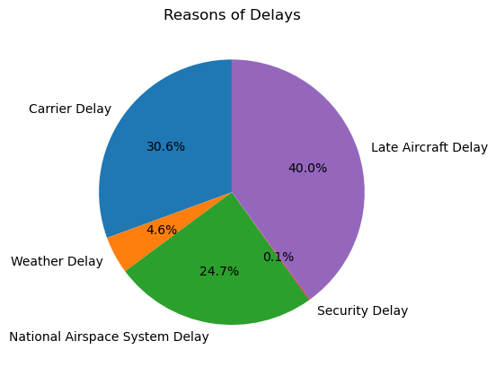
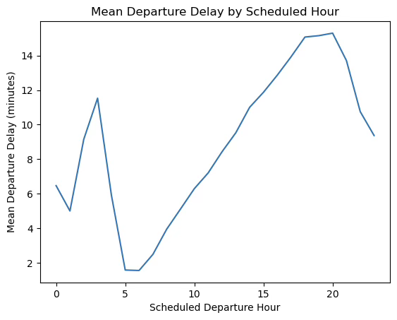
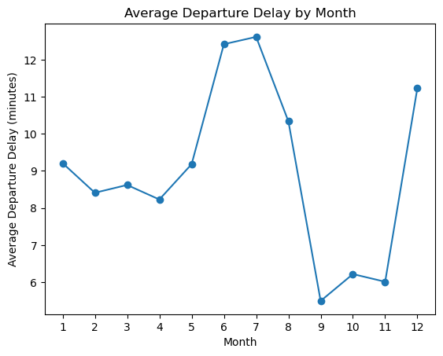

# Project of Data Visualization (COM-480)

| Student's name      | SCIPER |
| ------------------- | ------ |
| Aryan Ahadinia      | 387868 |
| Matin Ansaripour    | 370664 |
| Seyed Parsa Neshaei | 355567 |

(alphabetical order)

[Milestone 1](#milestone-1) • [Milestone 2](#milestone-2) • [Milestone 3](#milestone-3)

## Milestone 1 (21st March, 5pm)

delay
/dɪˈleɪ/

noun
    The nightmare of flyers.

copyright for [Pilot Bible](https://pilotbible.com/atc-slots-ready-message/)

**10% of the final grade**

This is a preliminary milestone to let you set up goals for your final project and assess the feasibility of your ideas.
Please, fill the following sections about your project.

*(max. 2000 characters per section)*

### Dataset

> Find a dataset (or multiple) that you will explore. Assess the quality of the data it contains and how much preprocessing / data-cleaning it will require before tackling visualization. We recommend using a standard dataset as this course is not about scraping nor data processing.
>
> Hint: some good pointers for finding quality publicly available datasets ([Google dataset search](https://datasetsearch.research.google.com/), [Kaggle](https://www.kaggle.com/datasets), [OpenSwissData](https://opendata.swiss/en/), [SNAP](https://snap.stanford.edu/data/) and [FiveThirtyEight](https://data.fivethirtyeight.com/)), you could use also the DataSets proposed by the ENAC (see the Announcements section on Zulip).

Flight delays are a day-to-day issue affecting millions of people worldwide. These delays have significant economic, operational, and social impacts and affect the airlines, the airport operations, and the travelers themselves ([Medium](https://medium.com/stanford-cs224w/graphing-the-skies-timely-flight-delay-prediction-using-spatio-temporal-gnns-879854f204ed#:~:text=The%20economic%20cost%20of%20flight,economic%2C%20social%2C%20and%20environmental%20aspects)). In this project, we explore a comprehensive dataset called *"Airline Delay and Cancellation Data, 2009 - 2018"*, available on [Kaggle](https://www.kaggle.com/datasets/yuanyuwendymu/airline-delay-and-cancellation-data-2009-2018), containing detailed information on flight delays for domestic flights within the United States. This dataset consists of records of flights of major airlines such as Delta, American, and United Airlines as well as smaller airlines through international and regional airports in the US. The data use the IATA code, a global standard for naming airports and airlines. This data is also well-equipped with scheduled and actual flight times, taxi time, wheels-off time, overall delay durations, and its breakdown for different reasons such as weather conditions, airline operational issues, and air traffic control. An important and probably the only stage that is required as preprocessing toward visualizing this data would be to complete it with the details of the airlines and the airport, such as name, the city they are located in, latitude and longitude (for visualization in a map format), the size of the airport, etc. This data can be extracted using WikiData API, as well as other online or offline data sources. The overall size of the data is over 7.5 GB and it necessitates pre-computing aggregation data to support real-time interactive visualizations without making the users wait for the plots to load. With that said, the size of the data and its overall cleanness are promising for extracting meaningful patterns without extensive preprocessing stages, which makes it an ideal dataset for our visualizations. In addition, as the data spans over 10 years, it allows us to uncover temporal trends in flight delays and help us gain insights on how the flight delay situation has changed over time.

### Problematic

> Frame the general topic of your visualization and the main axis that you want to develop.
> - What am I trying to show with my visualization?
> - Think of an overview for the project, your motivation, and the target audience.

Flight delays are a pervasive and frustrating experience for millions of travelers each year. These delays can come from a variety of factors, ranging from weather to operational inefficiencies, and impact not only passengers, but also airlines, airports, and broader logistical networks. Despite the scale of the issue, passengers often lack access to comprehensive and interpretable data that can help them make informed travel decisions. Moreover, stakeholders and professionals in the aviation sector struggle to identify delay trends at scale.

In this project, we aim to visualize patterns of domestic flight delays in the United States between 2009 and 2018. Our central axis include delay frequency and causes, and we aim to explore how does it vary across time, airlines, airports, and flight schedules. By this, we aim to answer questions such as: Which airports or airlines experience the most delays? How have delay times and causes changed over the years? Do flight times (e.g., morning versus evening) affect the likelihood of experiencing delays?

The primary audience for our project includes A) travelers who can use the visualizations to make better choices about flights, airlines, and airports, and B) researchers and policymakers who may use delay trends to find areas for operational improvement regarding transportation efficiency or advocate for passenger rights.

To serve this audience, we aim to develop an easy-to-use interactive visualization dashboard that allows users to compare airports and airlines, explore delay causes, and analyze temporal trends. Geo-spatial visualizations on a map, which we aim to include in our website, will further help users in locating the spots with higher likelihoods of delay across the US. Although the dataset is slightly outdated (with a cutoff date of 2018), the goal of our project is to demonstrate visualization approaches that are also scalable and adaptable to more recent rich datasets in case of availability in the future.

### Exploratory Data Analysis

> Pre-processing of the data set you chose
> - Show some basic statistics and get insights about the data

The dataset contains 61,556,964 records spanning ten years, ranging from ~ 5.6M records in 2016 to ~ 7.2M in 2018. Fig 1 shows a stacked bar chart of the number of flights per the top 10 airports with the most flights in the dataset. We observe that the top airports are major hubs such as ATL, ORD, and DFW, which is expected due to their high traffic volume. We see consistency in data with the top airlines being among the main carriers for the hub, e.g., Delta for ATL.

*Fig 1*

We find a mean departure delay of 9.04 mins with a median of zero, indicating that many flights do not depart late. A regression between the planned and actual time spent in a flight shows that actual flight durations usually match the scheduled durations (Fig 2). Similarly, for the arrival delay, we find a mean of 4.70 and a median of -1.00 minutes (arriving earlier than expected). We also find that the 75th percentile for this feature is 18 mins, meaning that most flights have relatively small delays. Observing the overall cancellation (1.58%) and diversion rate (0.24%) shows small relative values.

*Fig 2*

Exploring the overall trends across years, the mean departure delay peaks in 2014, but has a generally increasing pattern (Fig 3). For cancellation rates, we don't see a clear pattern over years (Fig 4).

*Fig 3*

*Fig 4*

We also find that flights scheduled earlier in the day (~ 5 AM) have less delays, with many even departing ahead of schedule. However, delays start accumulating until the afternoon (Fig 5) with the majority being due to the previous flight being late (Fig 6), reaching their maximum at ~ 8 PM (Fig 7). This is possibly due to higher congestion or rolling effects from earlier delays.

*Fig 5*

*Fig 6*

*Fig 7*

Additionally, we observe seasonal patterns in flight delays (Fig 8). They tend to peak in June/July which aligns with the vacation time. The lowest occurs in September, possibly due to lower travel demand directly after the holidays and the semester start.

*Fig 8*

### Related work

> - What others have already done with the data?
> - Why is your approach original?
> - What source of inspiration do you take? Visualizations that you found on other websites or magazines (might be unrelated to your data).
> - In case you are using a dataset that you have already explored in another context (ML or ADA course, semester project...), you are required to share the report of that work to outline the differences with the submission for this class.

The dataset has been previously analyzed by a couple of researchers, including Shaalan Marwan who provides an [analysis](https://github.com/ShaalanMarwan/airline-delay-and-cancellation) of this dataset, focusing on data statistics and static visualizations. Similarly, prior work [1] has utilized PowerBI to analyze this data, highlighting key performance indicators related to flight operations. Also, similar to our work has been done, but mostly limited to shorter-range data, e.g., two years ([Medium](https://medium.com/analytics-vidhya/modeling-flight-delays-through-u-s-flight-data-2f0b3d7e2c89), [NYCDatascience](https://nycdatascience.com/blog/r/flight-delays-r-shiny/)).

Moreover, there are other works related to our project, including [Flight Delay Information Panel of Federal Aviation Administration (FAA)](https://www.fly.faa.gov/flyfaa/usmap.jsp?legacy=true), [FlightAware](https://www.flightaware.com/live/cancelled), [TranStats](https://www.transtats.bts.gov/ot_delay/ot_delaycause1.asp) from the Bureau of Transportation Statistics, or this [Kaggle visualization](https://www.kaggle.com/code/anshuls235/data-story-telling-flights-delay), that provide visualizations and maps for the overall delay statistics. However, while those provide real-time information about the current status of the airports, they do not necessarily help users to extract patterns over time. [FlightRadar24](https://www.flightradar24.com/51.47,0.46/6) and [FlightStats](https://www.flightstats.com/v2/flight-tracker/search) also provide real-time details on the flights and the delays of the airports on a map. However, they are mainly designed for real-time tracking of a specific flight, not to compare trends among airports or airlines.

Particularly, we distinguish ourself by focusing on temporal patterns. By providing trends such as the accumulation of delays throughout the day and also variations in each season in our interactive dashboard, we aim to find how the patterns can inform operational strategies for airlines and airports. We thus focus on the practical applications of the data and aim to offer actionable insights that go beyond static visualizations or descriptive statistics.

Finally, there also exist works in the scholarly literature for predicting the delays using machine learning (ML) models [2, 3]. However, we are not interested in ML predictions but providing visualization to help users extract the underlying patterns.

We confirm that non of us has worked with this data before and this is our first time facing this data.

*References:*

[1]: Akachouche, Chafik. (2024). Flight analyzes data from 2009 to 2018 using PowerBI. 10.13140/RG.2.2.26957.96480. 

[2] Carvalho, L., Sternberg, A., Maia Gonçalves, L., Beatriz Cruz, A., Soares, J. A., Brandão, D., Carvalho, D., & Ogasawara, E. (2020). On the relevance of data science for flight delay research: A systematic review. Transport Reviews, 41(4), 499–528. https://doi.org/10.1080/01441647.2020.1861123.

[3] Wu, Y., Yang, H., Lin, Y., & Liu, H. (2022). Spatiotemporal Propagation Learning for Network-Wide Flight Delay Prediction. arXiv preprint arXiv:2207.06959. Retrieved from https://arxiv.org/abs/2207.06959.

## Milestone 2 (18th April, 5pm)

**10% of the final grade**

## Milestone 3 (30th May, 5pm)

**80% of the final grade**

## Late policy

- < 24h: 80% of the grade for the milestone
- < 48h: 70% of the grade for the milestone

